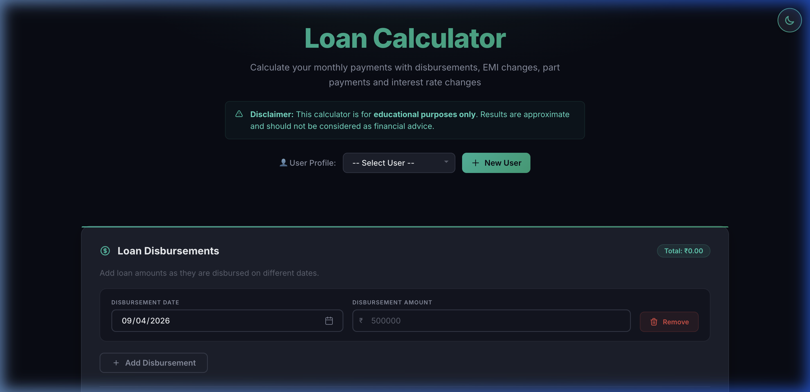
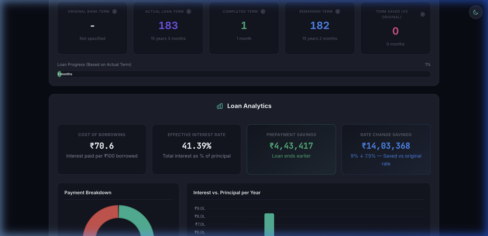
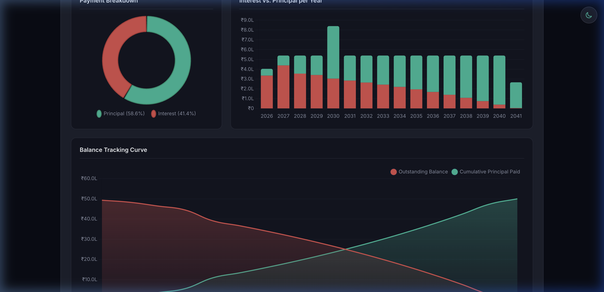
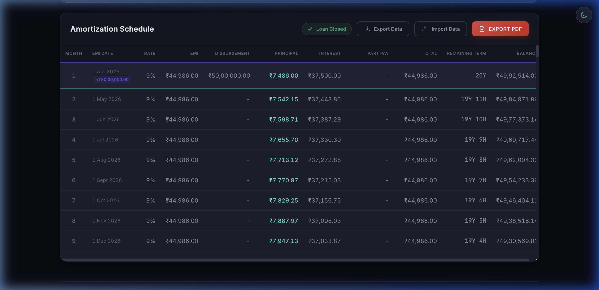
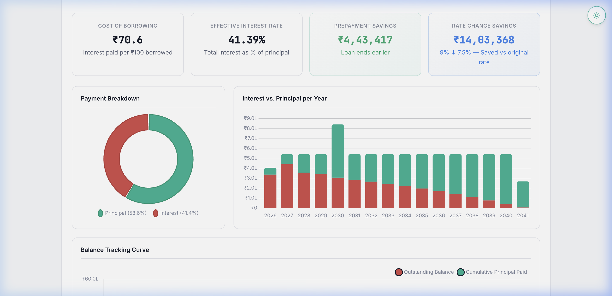
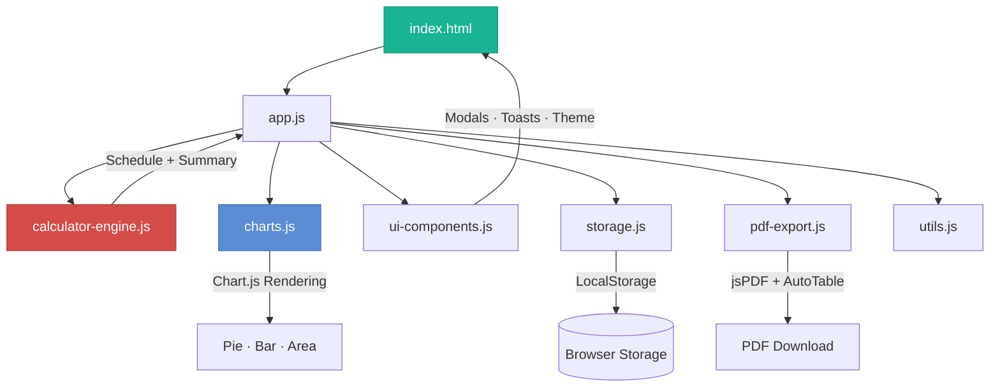
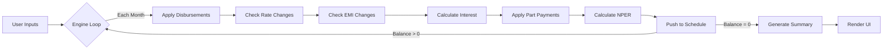
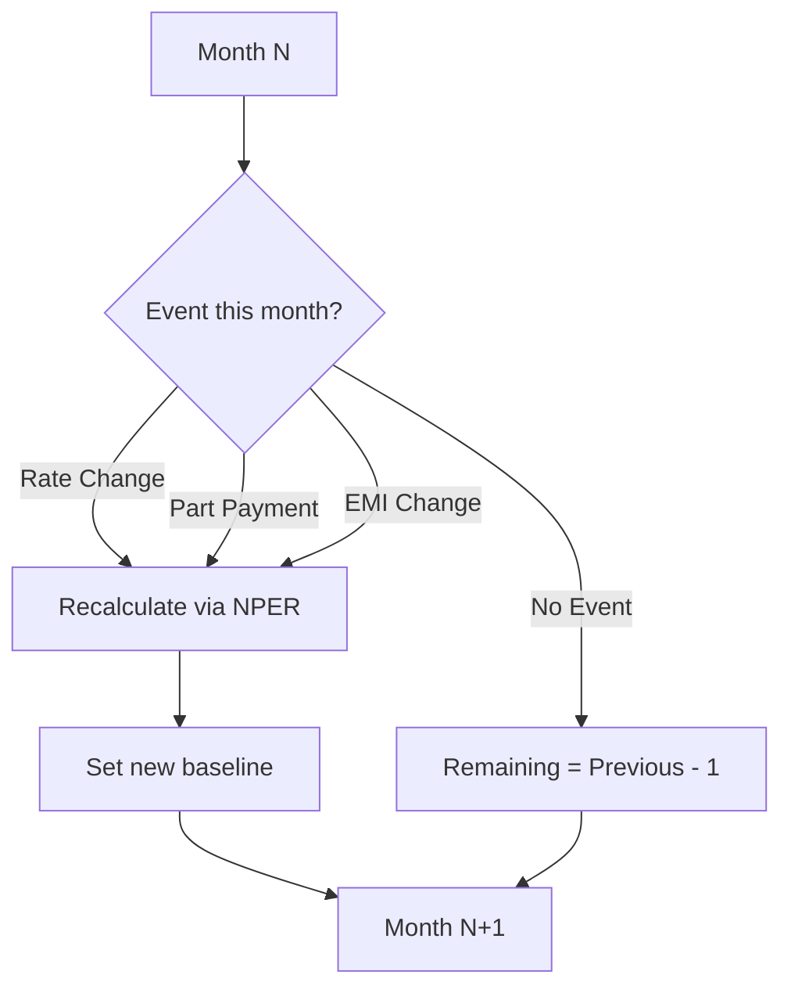

<div align="center">

# 💰 Loan Calculator

### A Professional-Grade EMI & Amortization Tool

[](https://mksantoki.github.io/Loan-Calculator/)
[](https://mksantoki.github.io/Loan-Calculator/)
[](LICENSE)

**A free, zero-login loan calculator with phased disbursements, floating rate changes, part payments, interactive analytics, and PDF export — all running client-side in your browser.**

<br/>



</div>

---

## ✨ Why This Calculator?

Most online EMI calculators are basic — enter principal, rate, tenure, get an EMI number. Real-world loans are far more complex:

- 🏗️ **Construction loans** disburse in phases, not all at once
- 📉 **Floating rates** change multiple times over 20 years
- 💸 **Part payments** can slash your interest by lakhs
- 📊 **You need analytics**, not just a number

This tool handles **all of it** — and shows you the exact financial impact of every decision.

---

## 🖼️ Screenshots

<details open>
<summary><strong>📊 Analytics Dashboard (Dark Mode)</strong></summary>
<br/>

</details>

<details>
<summary><strong>📈 Interactive Charts</strong></summary>
<br/>

</details>

<details>
<summary><strong>📋 Amortization Schedule</strong></summary>
<br/>

</details>

<details>
<summary><strong>☀️ Light Mode</strong></summary>
<br/>

</details>

---

## 🚀 Features

### Core Calculator Engine
| Feature | Description |
|---------|-------------|
| **Phased Disbursements** | Add multiple disbursement dates and amounts (e.g., for construction-linked loans) |
| **Floating Rate Changes** | Schedule interest rate changes at any future date |
| **EMI Changes** | Modify your EMI amount at any point during the loan |
| **Part Payments** | Model lump-sum payments and see the exact impact on interest & tenure |
| **Auto EMI Calculation** | Standard `P × r × (1+r)^n / ((1+r)^n - 1)` formula with one click |

### Analytics Dashboard
| Metric | What It Tells You |
|--------|-------------------|
| **Cost of Borrowing** | Interest paid per ₹100 borrowed — instant cost clarity |
| **Effective Interest Rate** | Total interest as a percentage of total amount paid |
| **Prepayment Savings** | Exact ₹ saved by making early part payments + time saved |
| **Rate Change Savings** | ₹ saved (or lost) compared to if the rate never changed |

### Interactive Charts
| Chart | Purpose |
|-------|---------|
| **Payment Breakdown** | Doughnut chart showing Principal vs Interest ratio |
| **Interest vs Principal per Year** | Stacked bar chart revealing how early EMIs are front-loaded with interest |
| **Balance Tracking Curve** | Gradient area chart showing the "crossing point" where principal overtakes balance |

### Amortization Schedule
| Column | Description |
|--------|-------------|
| **Month / EMI Date** | Sequential month number and exact payment date |
| **Rate / EMI** | Current interest rate and EMI amount (highlights changes) |
| **Disbursement** | Any new loan tranche disbursed that month |
| **Principal / Interest** | How your EMI splits between debt and cost |
| **Part Payment** | Any additional lump-sum payment made |
| **Remaining Term** | Dynamic NPER-based projection — drops instantly on events |
| **Balance** | Outstanding principal after all payments |

### Additional Features
- 🌗 **Dark / Light Theme** — Premium design system with smooth transitions
- 👤 **Multi-User Profiles** — Save different loan scenarios per user (LocalStorage)
- 📤 **Export to PDF** — Full amortization schedule with jsPDF + AutoTable
- 💾 **Import / Export Data** — JSON-based loan data backup and restore
- 📱 **Fully Responsive** — Works seamlessly on mobile, tablet, and desktop

---

## 🏗️ Architecture



### How the Calculation Engine Works



### Remaining Term — NPER Logic



> The dynamic `NPER` formula: `n = log(1 / (1 - (r × PV) / PMT)) / log(1 + r)` where `r` = monthly rate, `PV` = outstanding balance, and `PMT` = current EMI.

---

## 📂 Project Structure

```
Loan Calculator/
├── index.html              # Single-page application entry point
├── README.md               # This file
├── assets/                 # Screenshots and static resources
│   ├── hero-dark.png
│   ├── analytics-dashboard.png
│   ├── charts-bento.png
│   ├── amortization-table.png
│   └── light-mode.png
├── css/
│   ├── variables.css       # Design tokens (colors, spacing, fonts)
│   ├── reset.css           # CSS reset and base styles
│   ├── layout.css          # Grid systems and responsive layout
│   ├── components.css      # UI components (cards, buttons, inputs)
│   ├── sections.css        # Page sections (header, calculator, results)
│   ├── animations.css      # Micro-animations and transitions
│   └── modal-toast.css     # Modal dialogs and toast notifications
└── js/
    ├── app.js              # Main application controller (811 lines)
    ├── calculator-engine.js # Pure calculation logic + NPER
    ├── charts.js           # Chart.js rendering (Doughnut, Bar, Area)
    ├── ui-components.js    # Theme toggle, modals, toast system
    ├── storage.js          # LocalStorage CRUD for user profiles
    ├── pdf-export.js       # PDF generation with jsPDF
    └── utils.js            # Currency formatting, date helpers
```

---

## 🛠️ Tech Stack

| Layer | Technology | Purpose |
|-------|-----------|---------|
| **Structure** | HTML5 (Semantic) | Single-page application |
| **Styling** | Vanilla CSS | Custom design system with CSS variables |
| **Logic** | Vanilla JavaScript (ES Modules) | Zero-dependency calculation engine |
| **Charts** | [Chart.js](https://www.chartjs.org/) | Doughnut, Stacked Bar, and Area charts |
| **PDF** | [jsPDF](https://github.com/parallax/jsPDF) + [AutoTable](https://github.com/simonbengtsson/jsPDF-AutoTable) | Professional PDF export |
| **Fonts** | [Inter](https://fonts.google.com/specimen/Inter) + [JetBrains Mono](https://fonts.google.com/specimen/JetBrains+Mono) | Typography |
| **Hosting** | GitHub Pages | Static site deployment |

> **Zero build tools. No npm. No bundler.** Open `index.html` and it works.

---

## 🚀 Getting Started

### Option 1: Live Demo
Visit the hosted version: **[🔗 Live Demo](https://mksantoki.github.io/Loan-Calculator/)**

### Option 2: Run Locally

```bash
# Clone the repository
git clone https://github.com/YOUR_USERNAME/loan-calculator.git
cd loan-calculator

# Serve with any static server
python3 -m http.server 8090
# or
npx serve .
```

Then open `http://localhost:8090` in your browser.

### Option 3: Direct File
Simply open `index.html` in any modern browser — no server required for basic usage.

---

## 📖 Usage Guide

### Step 1 — Set Up Your Loan
1. **Create a User Profile** to save your data
2. **Add Disbursement(s)** — Date and amount for each loan tranche
3. **Set Interest Rate** and **Original Bank Term**
4. **Auto-calculate EMI** or enter a custom amount

### Step 2 — Model Scenarios
- 📉 **Add Rate Changes** — Simulate floating rate adjustments
- 💸 **Add Part Payments** — See how lump sums reduce your tenure and interest
- ✏️ **Add EMI Changes** — Model what happens if you increase/decrease your EMI

### Step 3 — Analyze Results
- 📊 **Loan Analytics** — Review the 4 key insight metrics
- 📈 **Charts** — Visualize payment patterns, balance curves, and yearly breakdowns
- 📋 **Amortization Table** — Scroll through every single EMI with dynamic Remaining Term
- 📤 **Export PDF** — Download a professional PDF report

---

## 🎨 Design System

The UI follows a custom **fintech-grade design system** with:

- **Dark Mode Default** — Deep navy surfaces (`#0b0e1a`) with teal accents (`#1ab394`)
- **Light Mode** — Clean whites with subtle blue-gray tones
- **Monospace Numbers** — JetBrains Mono for financial figures
- **Micro-Animations** — Smooth transitions on hover, cards, and theme switch
- **Accessibility** — Proper contrast ratios and semantic HTML

---

## 🤝 Contributing

Contributions are welcome! Feel free to:

1. Fork the repository
2. Create a feature branch (`git checkout -b feature/amazing-feature`)
3. Commit your changes (`git commit -m 'Add amazing feature'`)
4. Push to the branch (`git push origin feature/amazing-feature`)
5. Open a Pull Request

---

## 📄 License

This project is licensed under the MIT License — see the [LICENSE](LICENSE) file for details.

---

<div align="center">

**Built with ❤️ for smarter financial planning**

*For educational purposes only. Results are approximate and should not be considered financial advice.*

</div>
